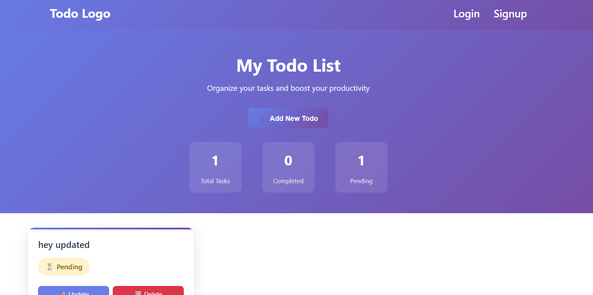
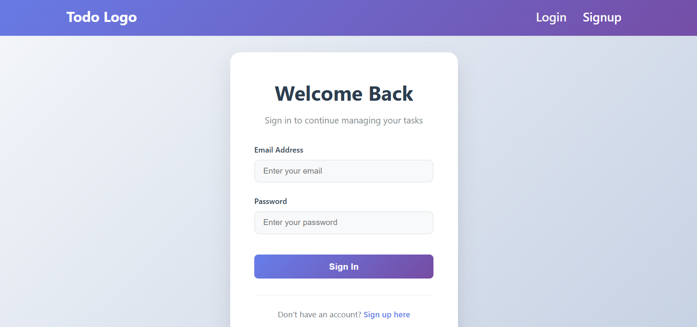
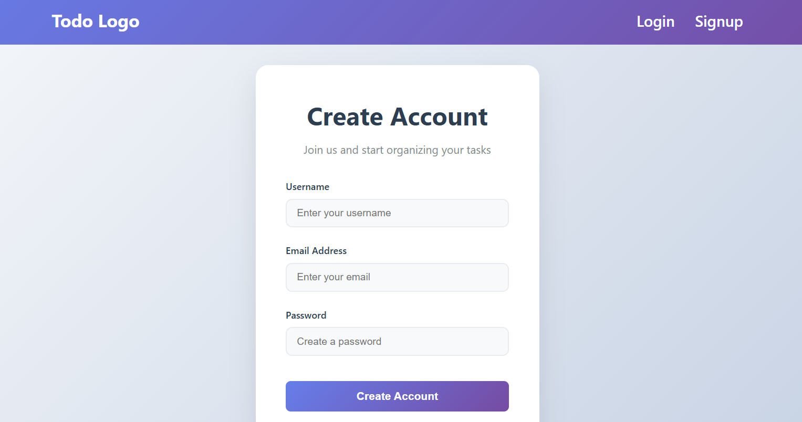

# 📝 Fullstack RBAC Todo App - Frontend

A modern frontend web application built using **HTML, CSS, and JavaScript**, featuring **real-time DOM manipulation**, **JWT authentication**, and **backend API integration** for persistent todo management with Role-Based Access Control (RBAC).

> *A comprehensive Task Manager that lets users manage todos with live updates, secure authentication, and role-based permissions synced to a Node.js backend server.*

---

## 🚀 Live Demo

🌐 [Live App]

---

## 📸 Screenshots
   
   



---

## 🎥 Video Walkthrough


---

## 🛠 Features

### 🔐 Authentication & Authorization
* ✅ **User Registration & Login** with email/password
* ✅ **JWT Token Management** (Access & Refresh tokens)
* ✅ **Automatic Token Refresh** when access token expires
* ✅ **Role-Based Access Control** (User/Admin roles)
* ✅ **Secure Session Management** with localStorage
* ✅ **Protected Routes** - automatic redirect to login

### 📋 Todo Management
* ✅ **CRUD Operations** - Create, Read, Update, Delete todos
* ✅ **Real-time Updates** - Instant UI updates after operations
* ✅ **Status Management** - Mark todos as pending/completed
* ✅ **Modal Interface** - Clean add/update todo modals
* ✅ **Dynamic Content** - Todos loaded from backend API

### 🎨 User Experience
* ✅ **Responsive Design** with Flexbox/Grid layouts
* ✅ **Form Validation** and error handling
* ✅ **Loading States** and user feedback
* ✅ **Keyboard Accessible** buttons & forms
* ✅ **Modern UI/UX** with clean styling

### 🔧 Technical Features
* ✅ **RESTful API Integration** via Fetch API
* ✅ **Async/Await** JavaScript patterns
* ✅ **Error Handling** with try-catch blocks
* ✅ **Module-based Architecture** with ES6 modules
* ✅ **Cross-browser Compatibility**

---

## 📁 Project Structure

```
fullstack_frontend/
├── assets/
│   ├── project_images/          # Project screenshots
│   └── readMe_Images/           # README images
├── components/
│   ├── footer.js               # Footer component
│   ├── navbar.js               # Navigation component
│   └── utlis.js                # Utility functions & base URL
├── styles/
│   ├── index.css               # Main styling
│   └── todos.css               # Todo-specific styles
├── scripts/
│   ├── index.js                # Home page logic
│   ├── login.js                # Login functionality
│   ├── signup.js               # Registration functionality
│   └── todos.js                # Todo CRUD operations
├── index.html                  # Landing page
├── login.html                  # Login page
├── signup.html                 # Registration page
├── todos.html                  # Todo management page
├── package.json                # Dependencies
└── README.md                   # This file
```

---

## 🧠 Concepts Demonstrated

### 🔧 Core JavaScript
* **DOM Manipulation**: `querySelector`, `createElement`, `appendChild`, `innerHTML`
* **Event Handling**: `click`, `submit`, `change`, `preventDefault()`
* **Class and Style Management**: `classList.add/remove/toggle`, `style.display`

### 🌐 Backend Integration
* **REST API Communication**: GET, POST, PATCH, DELETE requests
* **JWT Authentication**: Bearer token authorization
* **Token Management**: Access & refresh token handling
* **Error Handling**: Network errors, authentication failures
* **Async Operations**: `fetch()`, `async/await`, Promise handling

### 🔐 Security Features
* **Token Storage**: Secure localStorage management
* **Automatic Refresh**: Seamless token renewal
* **Session Validation**: Route protection
* **Error Recovery**: Graceful authentication failures

### 📱 Modern Web Development
* **ES6 Modules**: Import/export functionality
* **Responsive Design**: Mobile-first approach
* **Progressive Enhancement**: Graceful degradation
* **Accessibility**: Keyboard navigation support

---

## 🔌 Backend API Integration

The app integrates with a **Node.js/Express RESTful API** with the following endpoints:

### 🔐 Authentication Endpoints
* `POST /users/signup` - User registration
* `POST /users/login` - User login (returns JWT tokens)
* `POST /users/refresh-token` - Refresh access token

### 📋 Todo Management Endpoints
* `GET /todos/alltodos` - Fetch all user todos
* `POST /todos/add-todo` - Create new todo
* `PATCH /todos/update-todo/:id` - Update existing todo
* `DELETE /todos/delete-todo/:id` - Delete todo

### 🔒 Security Features
* **JWT Bearer Authentication** required for all todo operations
* **Role-based Access Control** (User/Admin permissions)
* **Token Blacklisting** for logout functionality
* **Automatic Token Refresh** when access token expires

---

## 🧪 How to Run Locally

### Prerequisites
* Modern web browser (Chrome, Firefox, Safari, Edge)
* Backend server running (see backend README)
* MongoDB database configured

### Setup Steps

1. **Clone the repository:**
```bash
git clone https://github.com/your-username/fullstack-rbac.git
cd fullstack-rbac/fullstack_frontend
```

2. **Configure backend URL:**
   - Edit `components/utlis.js`
   - Update `baseUrl` to match your backend server

3. **Start the backend server:**
```bash
cd ../fullstack_backend
npm install
npm run server
```

4. **Open the frontend:**
   - Open `index.html` in your browser, or
   - Use a local server: `python -m http.server 8000`
   - Navigate to `http://localhost:8000`

### 🔧 Development Setup

For development with live reload:
```bash
# Install live server globally
npm install -g live-server

# Start development server
live-server --port=8000
```

---

## 🧱 Tech Stack

### Frontend Technologies
* **HTML5** - Semantic markup and structure
* **CSS3** - Modern styling with Flexbox/Grid
* **JavaScript (ES6+)** - Modern JavaScript features
* **Fetch API** - HTTP requests and API integration
* **ES6 Modules** - Modular code organization

### Development Tools
* **Git** - Version control
* **Live Server** - Development server (optional)
* **Browser DevTools** - Debugging and testing

### Backend Integration
* **Node.js/Express** - RESTful API server
* **MongoDB** - Database storage
* **JWT** - Authentication tokens
* **bcrypt** - Password hashing

---

## 🔧 Key Features Implementation

### 🔐 Authentication Flow
1. **Registration**: User signs up with email/password
2. **Login**: User logs in, receives access & refresh tokens
3. **Token Storage**: Tokens stored in localStorage
4. **API Calls**: Access token sent with each request
5. **Auto Refresh**: Refresh token used when access token expires
6. **Session Management**: Automatic logout on token expiry

### 📋 Todo Operations
1. **Create**: Modal form for adding new todos
2. **Read**: Fetch and display all user todos
3. **Update**: Edit todo title and status
4. **Delete**: Remove todos with confirmation
5. **Real-time Updates**: UI updates immediately after operations

### 🛡️ Security Measures
1. **Token Validation**: Check token presence before API calls
2. **Error Handling**: Graceful handling of authentication failures
3. **Route Protection**: Redirect to login for unauthenticated users
4. **Secure Storage**: Tokens stored in browser localStorage

---

## 🌱 Future Improvements

### 🚀 Planned Features
* [ ] **Real-time Updates** with WebSocket integration
* [ ] **Offline Support** with Service Workers
* [ ] **Push Notifications** for todo reminders
* [ ] **Dark Mode** toggle
* [ ] **Todo Categories** and filtering
* [ ] **Bulk Operations** (select multiple todos)
* [ ] **Export/Import** functionality
* [ ] **Search and Sort** capabilities

### 🔧 Technical Enhancements
* [ ] **PWA Support** - Progressive Web App features
* [ ] **Unit Testing** with Jest
* [ ] **E2E Testing** with Cypress
* [ ] **Performance Optimization** - Lazy loading, caching
* [ ] **Accessibility Improvements** - ARIA labels, screen reader support
* [ ] **Internationalization** - Multi-language support

---

## 🐛 Known Issues & Solutions

### Common Issues
1. **CORS Errors**: Ensure backend CORS is configured properly
2. **Token Expiry**: Automatic refresh should handle this
3. **Network Errors**: Check backend server status
4. **MongoDB Connection**: Verify database connection

### Troubleshooting
* Check browser console for error messages
* Verify backend server is running on correct port
* Ensure MongoDB is connected and running
* Check network connectivity

---

## 📄 License

Licensed under [MIT License](./LICENSE)

---

## 👤 Author

**Nayan Hajare**
🔗 [Portfolio](https://your-portfolio.com)
🐙 [GitHub](https://github.com/your-username)


---

## 🙏 Acknowledgments

* **Masai School** - For the learning opportunity
* **Node.js Community** - For excellent documentation
* **MDN Web Docs** - For comprehensive JavaScript guides
* **Stack Overflow** - For community support


